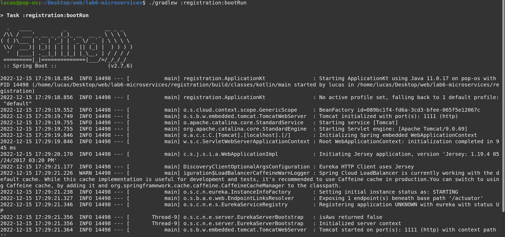
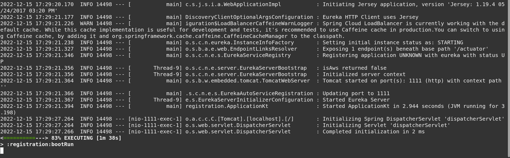
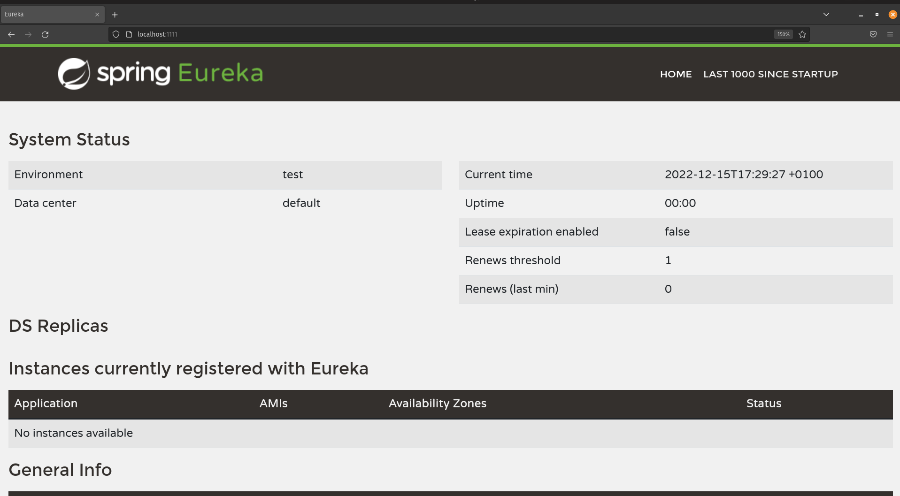
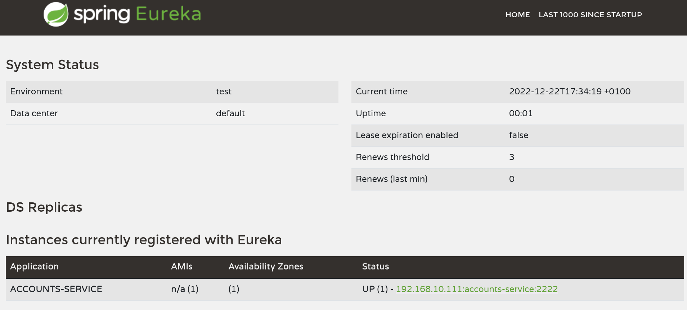
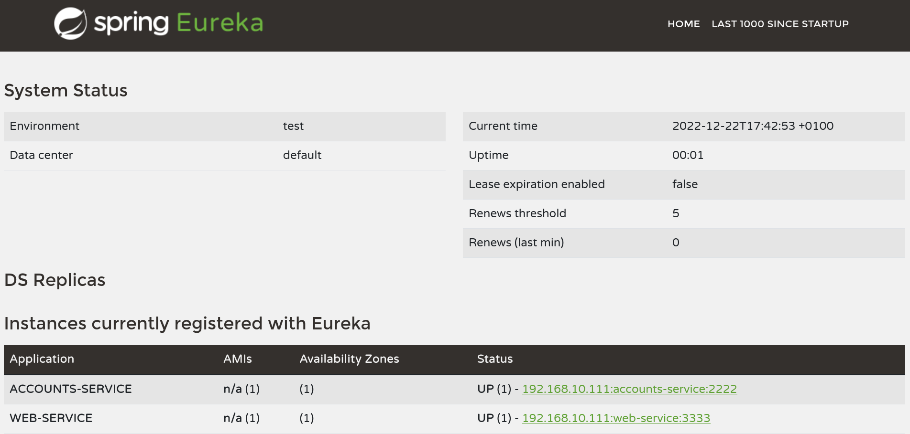
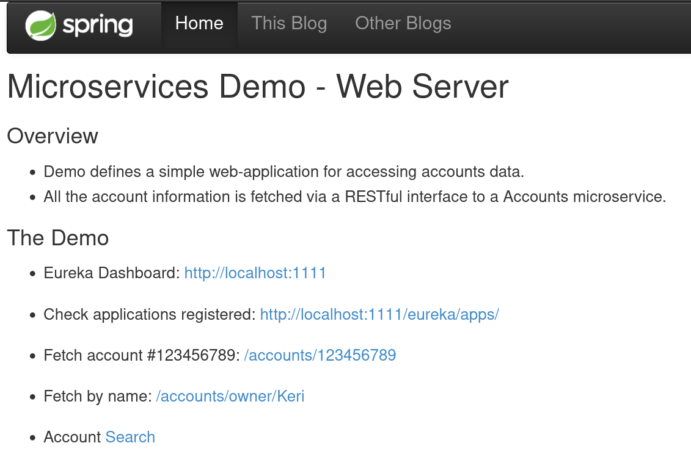

# Web Engineering 2022-2023 / Lab 6 Microservices Report
Lab6 tasks report realiced by Lucas López Solsona - 779898

|---------------------------------------------------------------------------------------------------|
Eureka server launched succesfully.

|---------------------------------------------------------------------------------------------------|
Machine registered succesfully.

As you can see in the image, now my machine is registered in the Eureka available machines, so it can
redistribute tasks to this machine.

|---------------------------------------------------------------------------------------------------|
Web server launched succesfully.

I launched a web server successfully in my PC, and it's linked to the Eureka services, so basically I can
use eureka and redistribute tasks to the different machines connected tu the Eureka's server.

