# Web Engineering 2022-2023 / Lab 6 Microservices Report
Lab6 tasks report realiced by Lucas López Solsona - 779898

|---------------------------------------------------------------------------------------------------|\n
Eureka server launched succesfully.
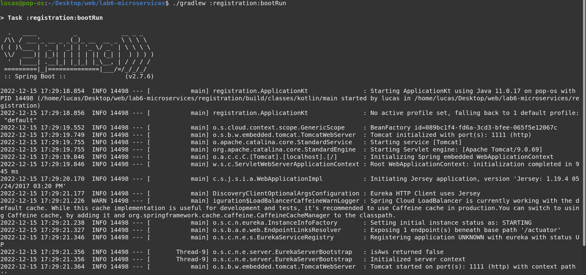
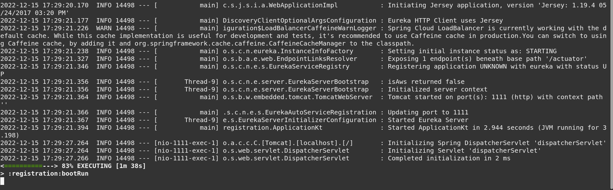
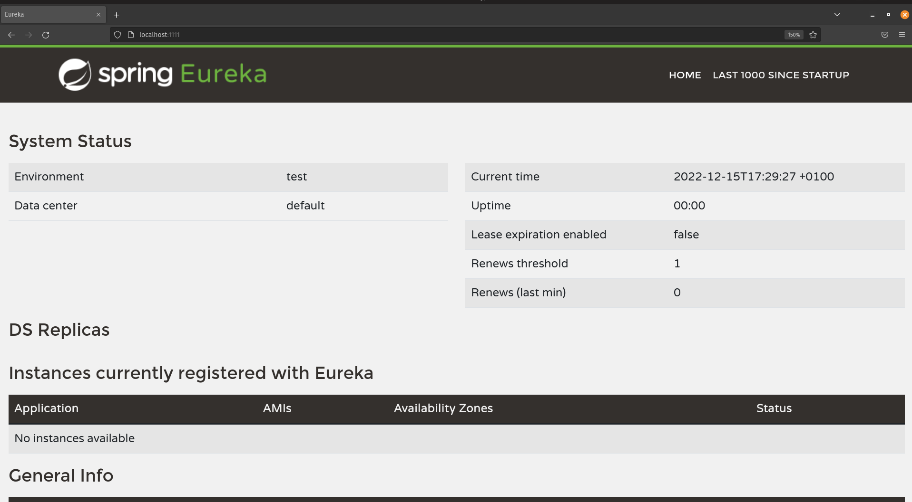

|---------------------------------------------------------------------------------------------------|\n
Machine registered succesfully.
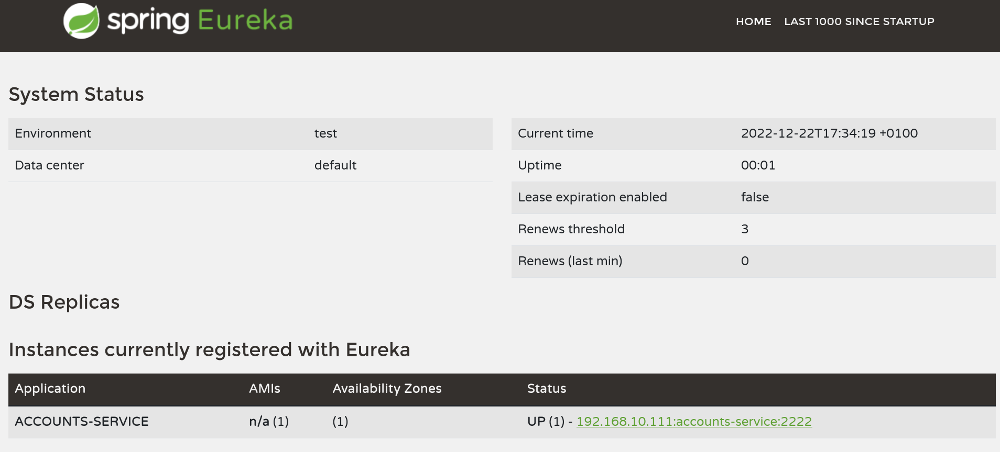
As you can see in the image, now my machine is registered in the Eureka available machines, so it can
redistribute tasks to this machine.

|---------------------------------------------------------------------------------------------------|\n
Web server launched succesfully.
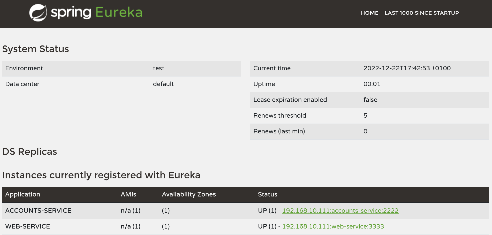
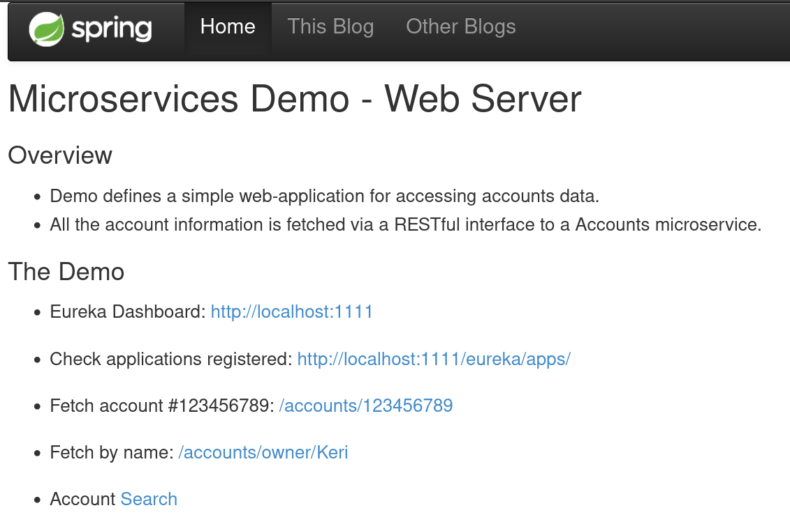
I launched a web server successfully in my PC, and it's linked to the Eureka services, so basically I can
use eureka and redistribute tasks to the different machines connected tu the Eureka's server.

|---------------------------------------------------------------------------------------------------|\n
Now we change the default port for the account service to 4444 and launch another account service.
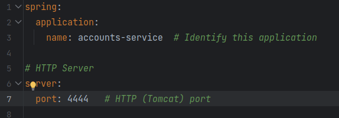
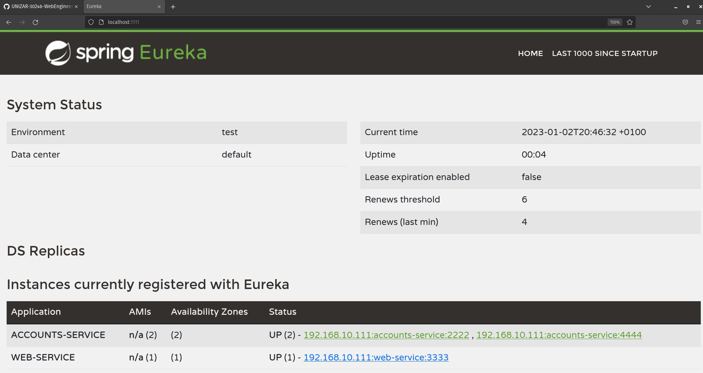
As we can see in the second image, there are two accounts services now.

|---------------------------------------------------------------------------------------------------|\n
Shutting down the account service hosted in port 2222
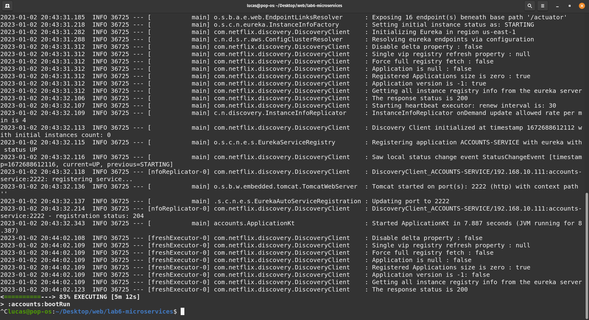
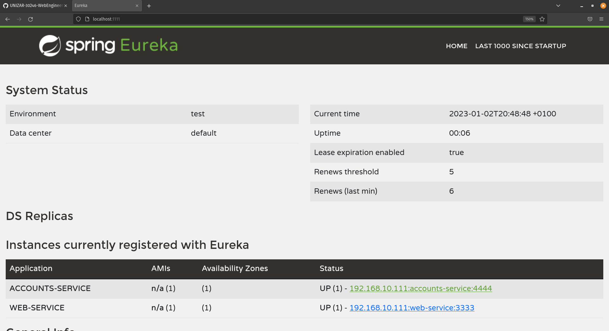

|---------------------------------------------------------------------------------------------------|\n
But if we fetch an account, the service keeps working, that is because the web server realizes the request
in Eureka where there are services registered. It finds an account service that keeps running in port 4444
and do the request through that machine.
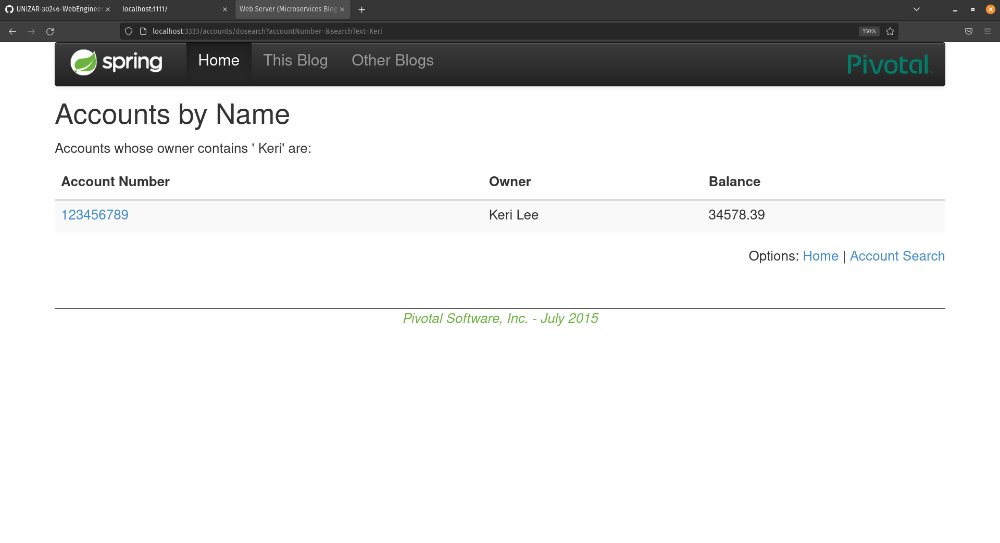
